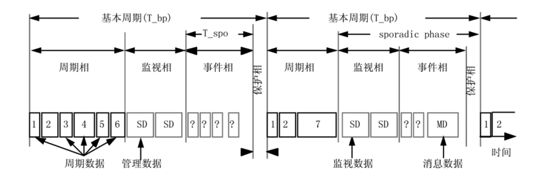

# MVB

  1. 列车通信总线(绞线式列车总线)：WTB(wire train bus)：连接一个车辆内设备的多功能车辆总线(MVB),总线能快速响应,工作速率为1.5Mbit/s,介质为双绞线或光纤。
  2. 车辆通信总线：MVB（Multifunction Vehicle Bus）：连接列车中各车辆的绞线式列车总线(WTB),总线能自己组态,工作速率为1Mbit/s,介质为双绞屏蔽线。
  3. 列车通信网络：TCN（Train Communication Network）其中包括了WTB，MVB
  4. 实时协议RTP(Real Time Protocol)用于TCN中的所有设备在MVB和WTB中通信
  5. TCN网络管理：TNM
  6. destributed processing 分布式处理
  7. FieldBus 现场总线
  8. 当接收到在两条线上的时滞不超过T_skew_r = 8.0 μs的有效帧信号时,接收器应正常工作并且产生无错误报告.
  9. 报文由主帧以及为响应此主帧而送出的从帧组成。
  10. 对于一个给定的总线,应答延时T_reply是指在主设备上测量而得的从主帧结束到响应此主帧的从帧的开始之间的最大可能的延时。
  11. 进程数据:周期性的,源寻址广播数据;消息数据:按需传送的,目标寻址的数据报文。
  12. 迁移标签：event[condition]{condition_action}/transition_action
  13. 主设备应在发送前一主帧后不迟于T_alive = 1.3 ms的时间内发送后一主帧。
  14. 一个基本周期可以分为4个相：周期相 监视相 事件相 保护相 
  15. T_spo的默认值为350us 基本周期T_bp小于T_alive = 1.3ms,主设备在特征周期T_ip时间内轮询每一个周期数据，特征周期等于 2 的 n 次方个基本周期,但不应超过 1024T_bp.
  
  
  

