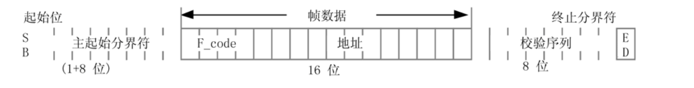

# MVB

  1. 列车通信总线(绞线式列车总线)：WTB(wire train bus)：连接一个车辆内设备的多功能车辆总线(MVB),总线能快速响应,工作速率为1.5Mbit/s,介质为双绞线或光纤。
  - 车辆通信总线：MVB（Multifunction Vehicle Bus）：连接列车中各车辆的绞线式列车总线(WTB),总线能自己组态,工作速率为1Mbit/s,介质为双绞屏蔽线。
  - 列车通信网络：TCN（Train Communication Network）其中包括了WTB，MVB
  - 实时协议RTP(Real Time Protocol)用于TCN中的所有设备在MVB和WTB中通信
  - TCN网络管理：TNM
  - destributed processing 分布式处理
  - FieldBus 现场总线
  - 当接收到在两条线上的时滞不超过T_skew_r = 8.0 μs的有效帧信号时,接收器应正常工作并且产生无错误报告.
  - 报文由主帧以及为响应此主帧而送出的从帧组成。
  - 对于一个给定的总线,应答延时T_reply是指在主设备上测量而得的从主帧结束到响应此主帧的从帧的开始之间的最大可能的延时。
  - 进程数据:周期性的,源寻址广播数据;消息数据:按需传送的,目标寻址的数据报文。
  - 迁移标签：event[condition]{condition_action}/transition_action
  - 主设备应在发送前一主帧后不迟于T_alive = 1.3 ms的时间内发送后一主帧。
  -  一个基本周期可以分为4个相：周期相 监视相 事件相 保护相 
  - T_spo的默认值为350us 基本周期T_bp小于T_alive = 1.3ms,主设备在特征周期T_ip时间内轮询每一个周期数据，特征周期等于 2 的 n 次方个基本周期,但不应超过 1024T_bp.
  
  - 一个基本周期分为4个相,即周期相监视相、事件相和保护相,图中? 表示在事件相内随机出现传输的数据。**监视相、事件相和保护相构成偶发相。**在周期相中,主设备执行对周期性数据的轮询。在事件相中，主设备执行偶发事件查询。**主设备利用监视相进行设备扫描和主权的传递**。在偶发相发送之后应保留一个保护相作为缓冲以提供下一个周期相的正确开始。如果要发送的最长响应时间大于剩余的到一个基本周期的时间,则主设备将不发送主帧。
  - MVB总线上的设备将一个轮回周期划分为固定的时间片， 这个时间片称为"基本周期"， 一个基本周期分为：周期相，监视相， 事件相， 保护相。
  - 宏周期由基本周期组成，其中最后一个基本周期用于主权转移。基本周期中有很多主帧和从帧，即：周期数据
  - **特征周期**是同一源的周期性数据两次连续发送的间隔，特征周期是基本周期的2^n倍。**宏周期**是最长的特征周期，
  - 主帧格式：
  
  - 主设备应在发送前一主帧后不迟于 T_alive = 1.3 ms 的时间内发送后一主帧 P212
  - 双线冗余，切换条件：
  	- 信任线未收到数据，而观察线收到数据时切换。
  	- 总线寂静时切换。
  	- 从上一个接收事件后总线寂静1.4ms则产生一总线寂静的通知。
  	- 上一个主帧接收后1.3ms没有收到主帧产生一个主帧超时的通知。
  	- 收到主帧后42.7us没有收到从帧产生从帧超时的通知。